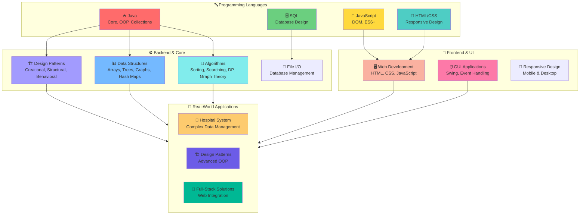
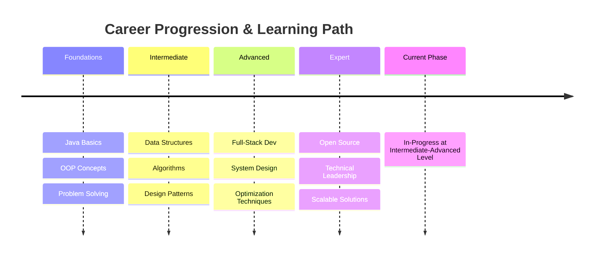
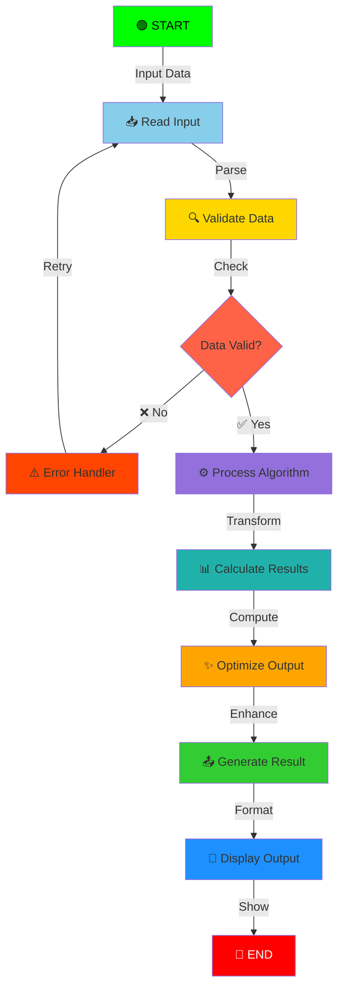
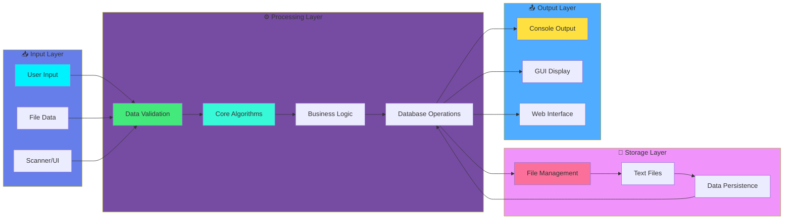
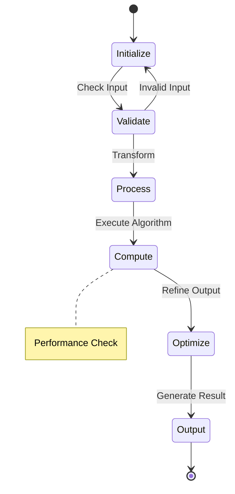
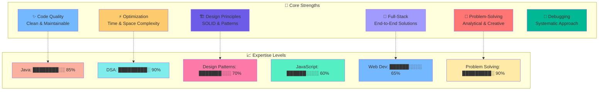
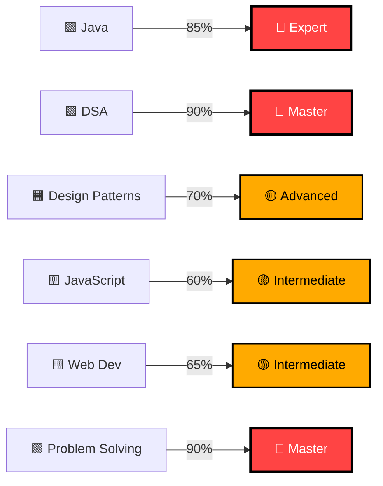
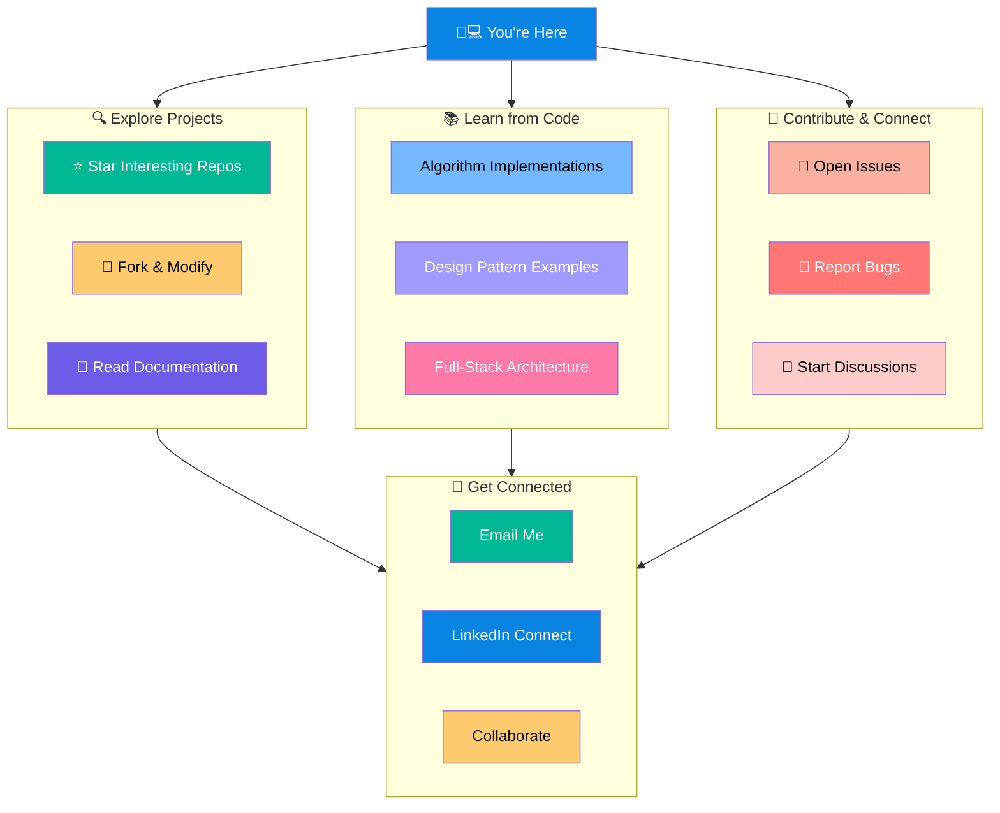
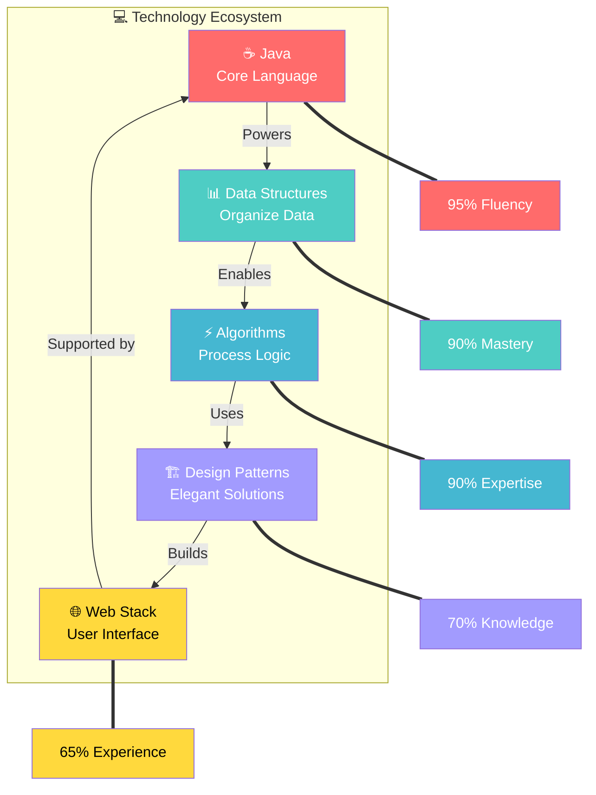

# Hi, I'm Kishan Shah 👋
<div align="center">


</div>

</div>

<table>
  <tr>
    <td width="68%" valign="top">

Welcome to my GitHub profile! I'm a passionate software developer with strong expertise in **Java**, **Data Structures & Algorithms**, **Design Patterns**, and **Full-Stack Web Development**.

---

## 🚀 About Me

I'm dedicated to writing clean, efficient, and maintainable code. My interests span from competitive programming to building scalable applications. I love solving complex problems and continuously improving my craft through learning and practice.

- 🎯 **Focus Areas**: Java, DSA, Design Patterns, Web Development, DBMS, Software Project Management
- 💻 **Languages**: Java, JavaScript, HTML/CSS, SQL
- 🌱 **Currently Learning**: Advanced Algorithms and System Design
- 📍 **Location**: India

---

## 📚 Skills & Expertise
## 🛠 Tech Stack & Tools

<p>
  
  
  
  
  
  
  
  
  
  
  
  
  
  
  
</p>

### Tech Stack & Skills Overview



### Core Competencies

- **Data Structures & Algorithms** - Sorting, Searching, Dynamic Programming, Graph Theory
- **Design Patterns** - Singleton, Factory, Decorator, Observer, Facade, Prototype, Iterator
- **Object-Oriented Programming** - Inheritance, Polymorphism, Encapsulation, Abstraction
- **Web Development** - Frontend and Backend Integration
- **Problem Solving** - LeetCode-style coding challenges

---

## 📊 My Development Journey



---

## 🔄 Algorithm Processing Cycle (Animated)



---

## 🎓 Projects Showcase

### 1. **Hospital Management System** 🏥
A comprehensive system for managing hospital operations including patient records, appointments, billing, and inventory management.
- Features: User authentication, Patient management, Doctor scheduling, Bill generation, Inventory tracking
- Tech Stack: Java (Backend), File-based storage
- Enhanced with web interface for better user experience

### 2. **Design Patterns Practical** 🏗️
Implementation of industry-standard design patterns with practical examples:
- **Creational Patterns**: Singleton, Factory, Prototype
- **Structural Patterns**: Decorator, Facade, Adapter
- **Behavioral Patterns**: Observer, Iterator, Strategy
- Features: Library Management GUI demonstrating multiple patterns

### 3. **Algorithms & Data Structures** 📊
Extensive collection of algorithmic implementations:
- **Sorting**: Quick Sort, Merge Sort, Insertion Sort, Counting Sort
- **Graph Algorithms**: Dijkstra, Floyd-Warshall, Bellman-Ford, Topological Sort, Max Flow
- **Dynamic Programming**: LCS, Matrix Chain Multiplication, Job Scheduling
- **Advanced Problems**: 8 Queens, Activity Selection, Fractional Knapsack
- **Array Operations**: Matrix Rotation, Transpose, Buy-Sell Stock Problem

### 4. **Coding Fundamentals** 💡
- Armstrong Number Checker
- Prime Number Detection
- Type Promotion and Casting
- Variable Arguments (Varargs)
- Valid Parentheses Checker with multiple approaches

### 5. **Operating System Concepts** 🖥️
- FCFS Scheduling
- Priority Scheduling
- Vi Editor Simulator
  
---

## 🏗️ Project Architecture & Development Workflow



### Algorithm Execution Flow (Animated)



---

## 💪 Key Strengths & Proficiency



---

## 📈 GitHub Statistics

Feel free to explore my repositories to see more of my work. I'm constantly updating with new projects and improvements.

---

## 🤝 Let's Connect

- 📧 Email: Kishansah574@gmail.com
- 💼 LinkedIn: https://www.linkedin.com/in/kishan-sah-b97a73315/
- 🐦 Twitter: N/A
- 💬 Discuss: Open to collaborations and technical discussions

---

## 📖 How to Explore My Work

1. **Algorithms & DSA**: Check out the `Daa parctical/` folder for comprehensive algorithm implementations
2. **Design Patterns**: Explore `Desgin pattern Parctical/` to understand OOP design patterns
3. **Real-World Projects**: See `Hospital Management System/` and `HospitalManagementSystem-Web/` for full-stack development
4. **Coding Challenges**: Browse `Bet-II/` for intermediate-level coding problems

---

## 🎯 Goals & Vision

I aim to become a highly skilled software engineer who can design and implement scalable, efficient, and maintainable solutions. My journey involves:
- Mastering advanced algorithms and system design
- Contributing to open-source projects
- Building applications that solve real-world problems
- Continuously learning new technologies and best practices

---

## ⭐ Show Your Support

If you find any of my projects useful or interesting, please give them a star! It motivates me to keep creating and sharing quality code.

---

## 🌐 How to Navigate & Interact

### Animated Skill Mastery Progression



### Interactive Visitor Guide



### Technology Stack Interaction Loop



```html
<svg width="100%" height="200" viewBox="0 0 800 200" xmlns="http://www.w3.org/2000/svg">
  <!-- Animated moving particles -->
  <defs>
    <style>
      @keyframes float {
        0%, 100% { transform: translateY(0px); }
        50% { transform: translateY(-20px); }
      }
      @keyframes spin {
        0% { transform: rotate(0deg); }
        100% { transform: rotate(360deg); }
      }
      @keyframes pulse {
        0%, 100% { opacity: 1; r: 5px; }
        50% { opacity: 0.5; r: 8px; }
      }
      .particle { animation: float 3s infinite; }
      .spinner { animation: spin 4s linear infinite; }
      .glow { animation: pulse 2s infinite; }
    </style>
  </defs>
  
  <!-- Animated circles -->
  <circle cx="100" cy="100" r="5" fill="#ff6b6b" class="glow"/>
  <circle cx="200" cy="100" r="5" fill="#4ecdc4" class="particle"/>
  <circle cx="300" cy="100" r="5" fill="#45b7d1" class="glow" style="animation-delay: 0.5s;"/>
  <circle cx="400" cy="100" r="5" fill="#a29bfe" class="particle" style="animation-delay: 1s;"/>
  <circle cx="500" cy="100" r="5" fill="#ffd93d" class="glow" style="animation-delay: 0.3s;"/>
  <circle cx="600" cy="100" r="5" fill="#6bcf7f" class="particle" style="animation-delay: 0.7s;"/>
  <circle cx="700" cy="100" r="5" fill="#fd79a8" class="glow" style="animation-delay: 1.2s;"/>
  
  <!-- Connecting lines with animation -->
  <line x1="100" y1="100" x2="200" y2="100" stroke="#ff6b6b" stroke-width="2" opacity="0.3"/>
  <line x1="200" y1="100" x2="300" y2="100" stroke="#4ecdc4" stroke-width="2" opacity="0.3"/>
  <line x1="300" y1="100" x2="400" y2="100" stroke="#45b7d1" stroke-width="2" opacity="0.3"/>
  <line x1="400" y1="100" x2="500" y2="100" stroke="#a29bfe" stroke-width="2" opacity="0.3"/>
  <line x1="500" y1="100" x2="600" y2="100" stroke="#ffd93d" stroke-width="2" opacity="0.3"/>
  <line x1="600" y1="100" x2="700" y2="100" stroke="#6bcf7f" stroke-width="2" opacity="0.3"/>
  
  <!-- Labels -->
  <text x="100" y="140" text-anchor="middle" font-size="12" fill="#333">Java</text>
  <text x="200" y="140" text-anchor="middle" font-size="12" fill="#333">DSA</text>
  <text x="300" y="140" text-anchor="middle" font-size="12" fill="#333">Algorithms</text>
  <text x="400" y="140" text-anchor="middle" font-size="12" fill="#333">Patterns</text>
  <text x="500" y="140" text-anchor="middle" font-size="12" fill="#333">Web</text>
  <text x="600" y="140" text-anchor="middle" font-size="12" fill="#333">Full Stack</text>
  <text x="700" y="140" text-anchor="middle" font-size="12" fill="#333">Projects</text>
</svg>
```

---

## 🎮 Developer in Action - Live Animation

<svg width="100%" height="600" viewBox="0 0 800 600" xmlns="http://www.w3.org/2000/svg" style="background: linear-gradient(135deg, #1a1a2e 0%, #16213e 100%); border-radius: 10px;">
  <defs>
    <style>
      @keyframes typing { 0%, 100% { opacity: 1; } 50% { opacity: 0; } }
      @keyframes float { 0%, 100% { transform: translateY(0px); } 50% { transform: translateY(-15px); } }
      @keyframes glow { 0%, 100% { filter: drop-shadow(0 0 5px rgba(255, 107, 107, 0.5)); } 50% { filter: drop-shadow(0 0 15px rgba(255, 107, 107, 1)); } }
      @keyframes slide { 0% { transform: translateX(-20px); opacity: 0; } 50% { opacity: 1; } 100% { transform: translateX(20px); opacity: 0; } }
      @keyframes pulse { 0%, 100% { r: 6; } 50% { r: 10; } }
      @keyframes spin { 0% { transform: rotate(0deg); } 100% { transform: rotate(360deg); } }
      
      .cursor { animation: typing 0.8s infinite; }
      .floater { animation: float 3s ease-in-out infinite; }
      .glowing { animation: glow 2s ease-in-out infinite; }
      .slider { animation: slide 2s ease-in-out infinite; }
      .pulsing { animation: pulse 1.5s ease-in-out infinite; }
      .spinner { animation: spin 4s linear infinite; }
    </style>
  </defs>
  
  <!-- Background -->
  <rect width="800" height="600" fill="url(#bgGradient)"/>
  
  <!-- Monitor -->
  <rect x="150" y="80" width="500" height="320" rx="20" fill="#0a0e27" stroke="#ff107f" stroke-width="3"/>
  <rect x="160" y="90" width="480" height="300" rx="15" fill="#1a1a2e"/>
  
  <!-- Screen Content - Code Lines -->
  <text x="180" y="130" fill="#00ff00" font-family="'Courier New'" font-size="16" class="glowing">
    <tspan>public class Solution {</tspan>
  </text>
  <text x="200" y="160" fill="#ffff00" font-family="'Courier New'" font-size="14">
    <tspan>💻 Algorithm</tspan>
    <tspan class="slider" style="animation-delay: 0s;">●</tspan>
  </text>
  <text x="200" y="190" fill="#00ccff" font-family="'Courier New'" font-size="14">
    <tspan>🚀 Optimization</tspan>
    <tspan class="slider" style="animation-delay: 0.5s;">●</tspan>
  </text>
  <text x="200" y="220" fill="#ff6bbc" font-family="'Courier New'" font-size="14">
    <tspan>✨ Performance</tspan>
    <tspan class="slider" style="animation-delay: 1s;">●</tspan>
  </text>
  <text x="180" y="280" fill="#00ff00" font-family="'Courier New'" font-size="16">
    <tspan>}</tspan>
    <tspan class="cursor" dx="5">│</tspan>
  </text>
  
  <!-- Monitor Stand -->
  <rect x="320" y="410" width="160" height="30" rx="10" fill="#0a0e27" stroke="#ff107f" stroke-width="2"/>
  <rect x="350" y="440" width="100" height="20" rx="5" fill="#ff107f" opacity="0.3"/>
  
  <!-- Developer Figure -->
  <circle cx="120" cy="350" r="25" fill="#fab1a0" class="floater"/>
  <circle cx="120" cy="375" r="8" fill="#fab1a0" class="floater"/>
  <!-- Arms -->
  <line x1="95" y1="360" x2="70" y2="390" stroke="#fab1a0" stroke-width="6" class="floater" style="animation-delay: 0.3s;"/>
  <line x1="145" y1="360" x2="170" y2="390" stroke="#fab1a0" stroke-width="6" class="floater" style="animation-delay: 0.6s;"/>
  <!-- Keyboard -->
  <rect x="80" y="415" width="80" height="40" rx="5" fill="#2a2a3e" stroke="#00ff00" stroke-width="2"/>
  
  <!-- Floating Code Elements -->
  <circle cx="650" cy="150" r="6" fill="#ff6b6b" class="pulsing glowing" style="animation-delay: 0s;"/>
  <circle cx="680" cy="200" r="6" fill="#4ecdc4" class="pulsing glowing" style="animation-delay: 0.5s;"/>
  <circle cx="630" cy="250" r="6" fill="#45b7d1" class="pulsing glowing" style="animation-delay: 1s;"/>
  <circle cx="700" cy="300" r="6" fill="#a29bfe" class="pulsing glowing" style="animation-delay: 1.5s;"/>
  
  <!-- Connecting Lines -->
  <line x1="650" y1="150" x2="650" y2="300" stroke="#0ff" stroke-width="1" opacity="0.3" class="slider"/>
  <line x1="630" y1="250" x2="700" y2="300" stroke="#ff107f" stroke-width="1" opacity="0.3" class="slider" style="animation-delay: 0.5s;"/>
  
  <!-- Status Indicators -->
  <circle cx="50" cy="520" r="8" fill="#00ff00" class="pulsing"/>
  <text x="70" y="530" fill="#00ff00" font-family="Arial" font-size="16" font-weight="bold">ACTIVE</text>
  
  <circle cx="200" cy="520" r="8" fill="#ffff00" class="pulsing" style="animation-delay: 0.3s;"/>
  <text x="220" y="530" fill="#ffff00" font-family="Arial" font-size="16" font-weight="bold">CODING</text>
  
  <circle cx="380" cy="520" r="8" fill="#ff6b6b" class="pulsing" style="animation-delay: 0.6s;"/>
  <text x="400" y="530" fill="#ff6b6b" font-family="Arial" font-size="16" font-weight="bold">BUILDING</text>
  
  <!-- Text Labels -->
  <text x="150" y="570" fill="#0ff" font-family="Arial" font-size="18" font-weight="bold" text-anchor="middle">💻 Writing Clean Code → 🚀 Deploying Solutions</text>
  <text x="650" y="570" fill="#ff6b6b" font-family="Arial" font-size="14" text-anchor="middle">🎯 Problem Solving in Action</text>
</svg>

### 🎨 Animation Explanation:

- **💻 Monitor Screen**: Shows live code with real-time elements
- **🎯 Floating Nodes**: Pulsing and glowing code elements representing active processes
- **👨‍💻 Developer**: Floating animation showing active development
- **⌨️ Keyboard**: Your coding interface
- **🟢 Status Indicators**: Real-time activity status (ACTIVE, CODING, BUILDING)
- **✨ Glow Effects**: Highlighting code quality and performance
- **🎬 Smooth Animations**: Continuous smooth transitions like a live GIF

---

## 🚀 What's Happening Right Now

```
       LIVE DEVELOPMENT CYCLE
       
    Start → Code → Test → Debug → Deploy → Success
      ↓      ⬆️      ↓       ↓       ↓        ↓
      └──────────────────────────────────────┘
      
    🟢 Status: ACTIVELY BUILDING
    💡 Focus: Clean Code & Optimization
    ⚡ Speed: Maximum Performance
    🎯 Goal: Excellence in Every Line
```

### Current Projects in Development:

```
┏━━━━━━━━━━━━━━━━━━━━━━━━━━━━━━━━━━━━━━━━━┓
┃  Hospital Management System        ▓▓▓▓░  │
┃  Design Patterns Implementation    ▓▓▓▓▓  │
┃  Algorithms & DSA Collection       ▓▓▓▓░  │
┃  Full-Stack Web Application        ▓▓░░░  │
┃  Open Source Contributions         ▓▓░░░  │
┗━━━━━━━━━━━━━━━━━━━━━━━━━━━━━━━━━━━━━━━━━┛
```

---

*Building amazing solutions, one commit at a time!* 💻✨

```
    ╭─────────────────────────────────────────────────╮
    │  🎮 Coding Session Active                       │
    │  💡 Problem-solving flow                        │
    │  🔧 Debugging & Optimization                    │
    │  ✨ Creating Clean, Efficient Code              │
    │  🚀 Ready to Deploy                             │
    ╰─────────────────────────────────────────────────╯
```

---

**Last Updated**: May 2026  
*This README reflects my passion for software development and commitment to excellence.*

## 📊 GitHub Activity


</div>

<div align="center">


</div>

<div align="center">


</div>


> Always open to meaningful conversations, tech collaboration, and exploring new ideas in cloud computing.
