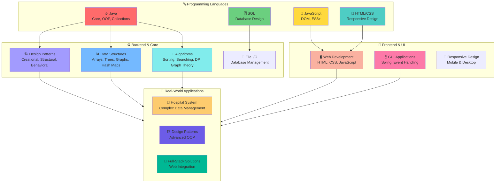
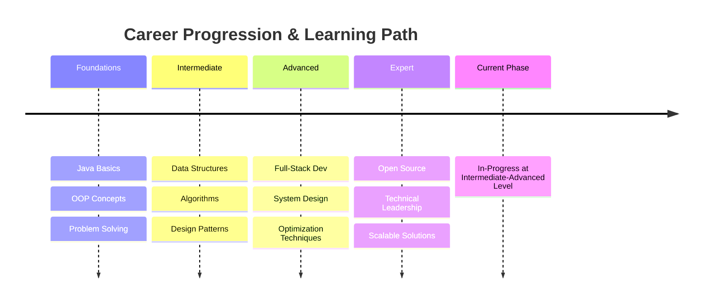
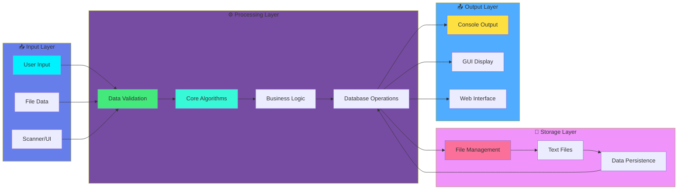
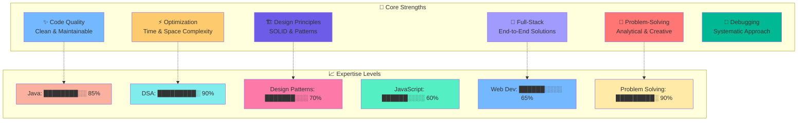
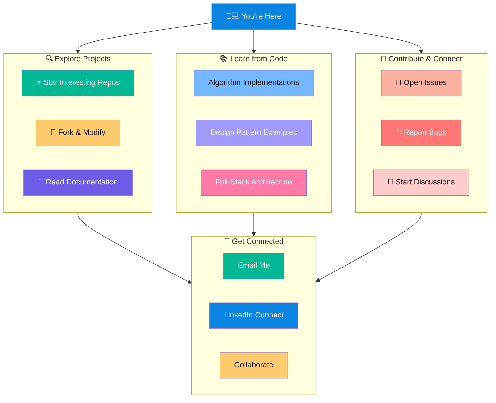

# Hi, I'm Kishan Shah 👋

Welcome to my GitHub profile! I'm a passionate software developer with strong expertise in **Java**, **Data Structures & Algorithms**, **Design Patterns**, and **Full-Stack Web Development**.

---

## 🚀 About Me

I'm dedicated to writing clean, efficient, and maintainable code. My interests span from competitive programming to building scalable applications. I love solving complex problems and continuously improving my craft through learning and practice.

- 🎯 **Focus Areas**: Java, DSA, Design Patterns, Web Development
- 💻 **Languages**: Java, JavaScript, HTML/CSS, SQL
- 🌱 **Currently Learning**: Advanced Algorithms and System Design
- 📍 **Location**: India

---

## 📚 Skills & Expertise

### Tech Stack & Skills Overview

### Core Competencies

- **Data Structures & Algorithms** - Sorting, Searching, Dynamic Programming, Graph Theory
- **Design Patterns** - Singleton, Factory, Decorator, Observer, Facade, Prototype, Iterator
- **Object-Oriented Programming** - Inheritance, Polymorphism, Encapsulation, Abstraction
- **Web Development** - Frontend and Backend Integration
- **Problem Solving** - LeetCode-style coding challenges

---

## 📊 My Development Journey

---

## 🎓 Projects Showcase

### 1. **Hospital Management System** 🏥
A comprehensive system for managing hospital operations including patient records, appointments, billing, and inventory management.
- Features: User authentication, Patient management, Doctor scheduling, Bill generation, Inventory tracking
- Tech Stack: Java (Backend), File-based storage
- Enhanced with web interface for better user experience

### 2. **Design Patterns Practical** 🏗️
Implementation of industry-standard design patterns with practical examples:
- **Creational Patterns**: Singleton, Factory, Prototype
- **Structural Patterns**: Decorator, Facade, Adapter
- **Behavioral Patterns**: Observer, Iterator, Strategy
- Features: Library Management GUI demonstrating multiple patterns

### 3. **Algorithms & Data Structures** 📊
Extensive collection of algorithmic implementations:
- **Sorting**: Quick Sort, Merge Sort, Insertion Sort, Counting Sort
- **Graph Algorithms**: Dijkstra, Floyd-Warshall, Bellman-Ford, Topological Sort, Max Flow
- **Dynamic Programming**: LCS, Matrix Chain Multiplication, Job Scheduling
- **Advanced Problems**: 8 Queens, Activity Selection, Fractional Knapsack
- **Array Operations**: Matrix Rotation, Transpose, Buy-Sell Stock Problem

### 4. **Coding Fundamentals** 💡
- Armstrong Number Checker
- Prime Number Detection
- Type Promotion and Casting
- Variable Arguments (Varargs)
- Valid Parentheses Checker with multiple approaches

### 5. **Operating System Concepts** 🖥️
- FCFS Scheduling
- Priority Scheduling
- Vi Editor Simulator

---

## 🏗️ Project Architecture & Development Workflow

---

## 💪 Key Strengths & Proficiency

---

## 📈 GitHub Statistics

Feel free to explore my repositories to see more of my work. I'm constantly updating with new projects and improvements.

---

## 🤝 Let's Connect

- 📧 Email: [Your Email]
- 💼 LinkedIn: [Your LinkedIn Profile]
- 🐦 Twitter: [Your Twitter Handle]
- 💬 Discuss: Open to collaborations and technical discussions

---

## 📖 How to Explore My Work

1. **Algorithms & DSA**: Check out the `Daa parctical/` folder for comprehensive algorithm implementations
2. **Design Patterns**: Explore `Desgin pattern Parctical/` to understand OOP design patterns
3. **Real-World Projects**: See `Hospital Management System/` and `HospitalManagementSystem-Web/` for full-stack development
4. **Coding Challenges**: Browse `Bet-II/` for intermediate-level coding problems

---

## 🎯 Goals & Vision

I aim to become a highly skilled software engineer who can design and implement scalable, efficient, and maintainable solutions. My journey involves:
- Mastering advanced algorithms and system design
- Contributing to open-source projects
- Building applications that solve real-world problems
- Continuously learning new technologies and best practices

---

## ⭐ Show Your Support

If you find any of my projects useful or interesting, please give them a star! It motivates me to keep creating and sharing quality code.

---

**Last Updated**: May 2026  
*This README reflects my passion for software development and commitment to excellence.*

---

## 🌐 How to Navigate & Interact

---

**Last Updated**: May 2026  
*This README reflects my passion for software development and commitment to excellence.*
